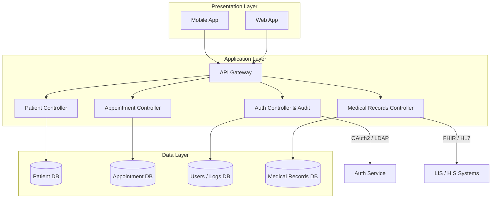

```mermaid
flowchart TB
    subgraph Presentation Layer
        A1[Mobile App]
        A2[Web App]
    end

    subgraph Application Layer
        B1[API Gateway]
        B2[Patient Controller]
        B3[Appointment Controller]
        B4[Auth Controller & Audit]
        B5[Medical Records Controller]
    end

    subgraph Data Layer
        C1[(Patient DB)]
        C2[(Appointment DB)]
        C3[(Users / Logs DB)]
        C4[(Medical Records DB)]
    end

    A1 --> B1
    A2 --> B1

    B1 --> B2
    B1 --> B3
    B1 --> B4
    B1 --> B5

    B2 --> C1
    B3 --> C2
    B4 --> C3
    B5 --> C4

    B4 -->|OAuth2 / LDAP| Ext1[Auth Service]
    B5 -->|FHIR / HL7| Ext2[LIS / HIS Systems]
```
